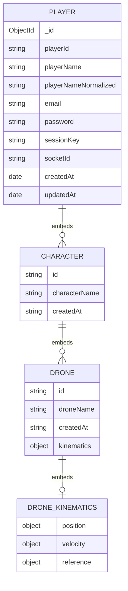

# MongoDB Schema and Relationships

This document describes the active MongoDB schema used by the Node.js server through Mongoose.

## Overview

The data model is document-oriented with a single root collection:

- Collection: players
- Root model: Player
- Embedded subdocuments:
  - Character (embedded in Player.characters)
  - Drone (embedded in Character.drones)

This is an aggregate-style model where all player-owned game state is stored in one Player document.

## Entity Relationship Diagram



## Player Schema

Defined in src/db/models.js.

### Fields

- _id: ObjectId
  - MongoDB-generated primary key.
- playerId: String
  - Required.
  - Unique index.
  - Application-level player identifier.
- playerName: String
  - Required.
  - Display name.
- playerNameNormalized: String
  - Required.
  - Unique index.
  - Lowercased by schema option.
  - Used for case-insensitive lookups.
- email: String
  - Required.
- password: String
  - Required.
- sessionKey: String | null
  - Defaults to null.
  - Tracks active session token.
- socketId: String | null
  - Defaults to null.
  - Tracks active socket connection.
- characters: Character[]
  - Embedded array of character subdocuments.
- createdAt: Date
  - Defaults to Date.now.
- updatedAt: Date
  - Defaults to Date.now.
  - Also refreshed by pre-save hook.

### Indexes and Constraints

- Unique index on playerId.
- Unique index on playerNameNormalized.

## Character Subdocument Schema

Embedded under Player.characters.

### Fields

- id: String (required)
- characterName: String (required)
- createdAt: String (required)
- drones: Drone[]

Notes:
- _id is disabled for Character subdocuments (_id: false).
- Character identifiers use the id field, not MongoDB ObjectId.

## Drone Subdocument Schema

Embedded under Player.characters[].drones.

### Fields

- id: String (required)
- droneName: String (required)
- createdAt: String (required)
- kinematics: DroneKinematics | null (optional)
  - Contains position, velocity, and spatial reference information
  - Default: null

### DroneKinematics Subdocument Fields

- position: Triple (required)
  - x: Number - X coordinate
  - y: Number - Y coordinate
  - z: Number - Z coordinate
- velocity: Triple (required)
  - x: Number - X velocity component
  - y: Number - Y velocity component
  - z: Number - Z velocity component
- reference: SpatialReference (required)
  - solarSystemId: String - Reference solar system identifier
  - referenceKind: String - 'barycentric' or 'body-centered'
  - referenceBodyId: String | null - Optional reference body identifier
  - epochMs: Number - Epoch timestamp in milliseconds

Notes:
- _id is disabled for Drone subdocuments (_id: false).
- Drone identifiers use the id field, not MongoDB ObjectId.
- Kinematics data is optional and can be null when not applicable.

## Relationship Semantics

- One Player to many Characters: 1:N (embedded)
- One Character to many Drones: 1:N (embedded)

All relationships are ownership relationships contained in a single Player document.

## Access Patterns

The service layer in src/db/service.js uses playerNameNormalized as the primary query key for most operations:

- Register player
- Fetch player by name
- Update player session/socket
- Add, edit, delete characters
- Add and fetch drones

Because Character and Drone are embedded, operations commonly update a single Player document.

## Lifecycle Behavior

A pre-save middleware on Player sets:

- updatedAt = new Date()

This runs on save operations and keeps modification timestamps current.

## Practical Implications

- Strong locality: player + characters + drones are read together efficiently.
- Simpler joins: no cross-collection joins for character/drone data.
- Document growth: large character/drone lists increase Player document size.
- Consistency: player-owned game state updates are naturally scoped to one document.

## Example Documents

### Player Document (with embedded Character and Drone)

```json
{
  "_id": "661f9a53e8f93b0b2d4f12a1",
  "playerId": "player-8a4d2e54",
  "playerName": "OrbitFox",
  "playerNameNormalized": "orbitfox",
  "email": "orbitfox@example.com",
  "password": "plain-text-in-dev-only",
  "sessionKey": "8ce4a2a7-7a6f-4559-8e22-2e95a9a0f6b4",
  "socketId": "yYfU4dG2qv95uT4xAAAB",
  "characters": [
    {
      "id": "character-cf86b7",
      "characterName": "RangerOne",
      "createdAt": "2026-04-19T12:00:00.000Z",
      "drones": [
        {
          "id": "character-cf86b7-drone-1",
          "droneName": "RangerOne Drone 1",
          "createdAt": "2026-04-19T12:00:00.000Z",
          "kinematics": {
            "position": {
              "x": 100.5,
              "y": 200.3,
              "z": 50.1
            },
            "velocity": {
              "x": 0.5,
              "y": -0.2,
              "z": 0.1
            },
            "reference": {
              "solarSystemId": "system-sol",
              "referenceKind": "barycentric",
              "referenceBodyId": null,
              "epochMs": 1713607200000
            }
          }
        }
      ]
    }
  ],
  "createdAt": "2026-04-19T11:58:10.000Z",
  "updatedAt": "2026-04-19T12:00:00.000Z",
  "__v": 0
}
```

### Character Subdocument (shape)

```json
{
  "id": "character-cf86b7",
  "characterName": "RangerOne",
  "createdAt": "2026-04-19T12:00:00.000Z",
  "drones": [
    {
      "id": "character-cf86b7-drone-1",
      "droneName": "RangerOne Drone 1",
      "createdAt": "2026-04-19T12:00:00.000Z"
    }
  ]
}
```

### Drone Subdocument (shape)

```json
{
  "id": "character-cf86b7-drone-1",
  "droneName": "RangerOne Drone 1",
  "createdAt": "2026-04-19T12:00:00.000Z",
  "kinematics": {
    "position": {
      "x": 100.5,
      "y": 200.3,
      "z": 50.1
    },
    "velocity": {
      "x": 0.5,
      "y": -0.2,
      "z": 0.1
    },
    "reference": {
      "solarSystemId": "system-sol",
      "referenceKind": "barycentric",
      "referenceBodyId": null,
      "epochMs": 1713607200000
    }
  }
}
```

## Before and After Operation Examples

### Login Operation Update

When a login succeeds, the server updates sessionKey, socketId, and updatedAt.

Before:

```json
{
  "playerNameNormalized": "orbitfox",
  "sessionKey": null,
  "socketId": null,
  "updatedAt": "2026-04-19T11:58:10.000Z"
}
```

After:

```json
{
  "playerNameNormalized": "orbitfox",
  "sessionKey": "8ce4a2a7-7a6f-4559-8e22-2e95a9a0f6b4",
  "socketId": "yYfU4dG2qv95uT4xAAAB",
  "updatedAt": "2026-04-19T12:05:40.000Z"
}
```

### Character Add Operation Update

When a character is added, a new Character subdocument is pushed into characters and updatedAt is refreshed.

Before:

```json
{
  "playerNameNormalized": "orbitfox",
  "characters": [],
  "updatedAt": "2026-04-19T12:05:40.000Z"
}
```

After:

```json
{
  "playerNameNormalized": "orbitfox",
  "characters": [
    {
      "id": "character-cf86b7",
      "characterName": "RangerOne",
      "createdAt": "2026-04-19T12:07:00.000Z",
      "drones": [
        {
          "id": "character-cf86b7-drone-1",
          "droneName": "RangerOne Drone 1",
          "createdAt": "2026-04-19T12:07:00.000Z"
        }
      ]
    }
  ],
  "updatedAt": "2026-04-19T12:07:00.000Z"
}
```
